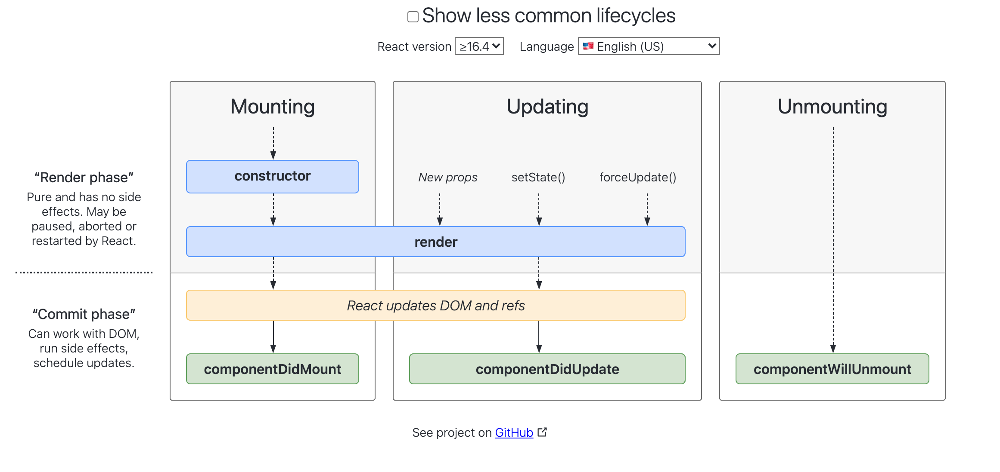

# React

- [React TypeScript Cheatsheet](https://react-typescript-cheatsheet.netlify.app/docs/basic/getting-started/function_components)
- [公式:Reactの流儀](https://ja.reactjs.org/docs/thinking-in-react.html)

## js vs ts

### ts の Pros

- 静的型付け言語
- 型推論
- Null 安全性
  - NullPointerException(Java)の回避
- IDE でコンパイル前にエラーを確認できる
- [Slack ブログ](https://www.infoq.com/jp/news/2017/04/going-typescript-slack/)
- [Airbnb](https://www.infoq.com/jp/news/2020/02/airbnb-graphql-migration/)

### ts の Cons

- 学習コスト
- コンパイルに時間がかかる

## Create React App

- JS

```
$ npx create-react-app {app名}
```

- TypeScript

```
$ npx create-react-app {app名} --template=typescript
```

- <React.StrictMode> とは
  バージョンが進んで非推奨になった API の使用や意図しない副作用といった、アプリケーションの潜在的な問題点を見つけて
  warning で教えてくれる React の『Strict モード 42』という機能を有効にするためのラッパー。
  アプリケーションをより安全なものにするために Create React App がバージョン 3.4.1 からデフォルトで追加してくれるようになった

- コンパイル
  CRA で作成したプロジェクトでは、ソースコードファイルはコンパイラである Babel によってコンパイルされて、
  それがバンドラである webpack によって適切な形にまとめられ、さらにそれらが相互に関連付けられる

- pkg の update
  package.json に記述してある各パッケージのバージョン範囲に従って、全てのインストール済みのパッケージを一括アップデートする

```
yarn upgrade-interactive --latest
```

- webpack
  - [最新版で学ぶ webpack 5 入門 JavaScript のモジュールバンドラ](https://ics.media/entry/12140/)

## tsconfig.json

- "jsx": "react-jsx"
  - これが有効になっていると、`import React from 'react'`文が省略できる
  - `"jsx": "react"`にすると`import`文が必要になる
  - [新しい JSX トランスフォーム](https://ja.reactjs.org/blog/2020/09/22/introducing-the-new-jsx-transform.html)

## JSX の記述

- トップレベルの要素は 1 つでなければいけない
- ReactElement オブジェクトを生成するためのシンタックスシュガー

```ts
// Error
const elems = (
  <div>foo</div>
  <div>bar</div>
  <div>baz</div>
)

// Valid
// フラグメント(空のタグ)を使うことで、不要なノードを追加することなくまとめて扱える
const elems = (
  <>
    <div>foo</div>
    <div>bar</div>
    <div>baz</div>
  </>
)
```

## props

- Properties（プロパティ）』の略で、コンポーネントを関数として考えたとき、その引数に相当するもの
- 基本的にはコンポーネントが呼ばれるときに外から与えられる読み取り専用の変数グループをオブジェクトにまとめたもの

## コンポーネント

- ユーザー定義コンポーネント

  - 必ず大文字から始めること(小文字から始めると、呼び出すことができなくなる)

- 組み込みコンポーネント
  - html と記述が異なる主なもの
    - `class` -> `className`
    - `for` -> `htmlFor`

## Linter

- [npm trends of linter](https://www.npmtrends.com/eslint-vs-tslint-vs-awesome-typescript-loader-vs-ts-loader-vs-prettier-vs-standard-vs-eslint-config-airbnb-vs-beautify-vs-jshint-vs-eslint-config-google)
- 主流は`ESLint`

### ESLint の環境構築

- バージョン確認

```sh
yarn list eslint
```

- 各種パッケージを最新にする(必要に応じて)

```sh
yarn upgrade-interactive --latest
yarn upgrade typescript@latest
```

- TypeScript ESLint が提供しているパッケージ群をインストール
  - `typescript-eslint-parser` と `eslint-plugin-typescript`もあるが、これらは非推奨
  - ESLint 本体を除くエコシステムのパッケージは主に 3 種類
    - パーサ(Parser) ... ソースコードを特定の言語仕様に沿って解析してくれるライブラリ。ESLint には JavaScript のパーサが組み込まれているが、標準では TypeScript には対応していないので、TypeScript のパーサを導入する
    - プラグイン（Plugin）... ESLint の組み込みルール以外に独自のルールを追加するもの。それらを適用した推奨の共有設定とパッケージングして提供されることが多い
    - 共有設定（Shareable Config）... 複数のルールの適用をまとめて設定するもの。ESLint に同梱される eslint:recommended や Airbnb 社が提供している eslint-config-airbnb14 が有名

```sh
 # まずはESLintの設定ファイルを作成
$ yarn eslint --init
? How would you like to use ESLint?
》To check syntax, find problems, and enforce code style

? What type of modules does your project use? JavaScript modules (import/export)
》JavaScript modules (import/export)

? Which framework does your project use?
》React

? Does your project use TypeScript?
》Yes

? Where does your code run?
》Browser

? How would you like to define a style for your project?
》Use a popular style guide

? Which style guide do you want to follow?
》Airbnb: https://github.com/airbnb/javascript

? What format do you want your config file to be in?
》JavaScript

The config that you've selected requires the following dependencies:

eslint-plugin-react@^VERSION @typescript-eslint/eslint-plugin@latest eslint-config-airbnb@latest eslint@^VERSION eslint-plugin-import@^VERSION eslint-plugin-jsx-a11y@^VERSION eslint-plugin-react-hooks@^VERSION @typescript-eslint/parser@latest
? Would you like to install them now with npm?
》No

# 最後にNoと答えるのは、yarnでパッケージ管理を統一するため。
# Yesにすると、npmでインストールされる

```

- 最後に No と答えたので、拡張ルールセットやプラグインはまだインストールされていないため、以下のコマンドでインストールする

```sh
$ yarn add -D eslint-plugin-react @typescript-eslint/eslint-plugin \
 eslint-config-airbnb eslint-plugin-import eslint-plugin-jsx-a11y \
 eslint-plugin-react-hooks @typescript-eslint/parser
$ typesync
$ yarn
```

- eslint.js の設定

```js
extends: [
  'plugin:react/recommended',
  'airbnb',
  'airbnb/hooks',
  'plugin:import/errors',
  'plugin:import/warnings',
  'plugin:import/typescript',
  'plugin:@typescript-eslint/recommended',
  'plugin:@typescript-eslint/recommended-requiring-type-checking',
],
```

その他多くの設定があるので、必要に応じて書籍で確認すること。

## フォーマッタ

- Prettier
  - ESLint とバッティングすることがあるから、設定に注意が必要
  - `eslint-plugin-prettir`は公式で非推奨となった

設定については、必要に応じて書籍で確認すること。

## CSS Linter

- stylelint

設定については、必要に応じて書籍で確認すること。

## Flux と Redux

[Flux と Redux](https://codezine.jp/article/detail/10751#:~:text=Flux%EF%BC%88%E3%83%95%E3%83%A9%E3%83%83%E3%82%AF%E3%82%B9%EF%BC%89%E3%81%AFFacebook%E7%A4%BE,%E3%81%93%E3%81%A8%E3%81%8C%E5%A4%A7%E3%81%8D%E3%81%AA%E3%83%A1%E3%83%AA%E3%83%83%E3%83%88%E3%81%A7%E3%81%99%E3%80%82)

- Flux

  > Flux（フラックス）は Facebook 社が提唱している、クライアントサイドの Web アプリケーション開発のためのアプリケーション・アーキテクチャ（設計思想）です。単方向のデータフローを構築できることが最大の特徴で、開発の規模が大きくなってもデータの流れを見失いづらいことが大きなメリットです。React との併用を主に想定して生み出されたため、React による Web アプリケーション開発を行う多くの現場で採用されています。

- Redux(Flux のライブラリ)
  > データ管理の機構が分かりやすい
  > デファクトスタンダードになりつつあり、Web 上の情報が多いため、トラブルシューティングが容易
  > 込み入ったことをしたくなった場合の拡張性に優れている
  > 拡張のためのライブラリが豊富に存在する

## 仮想 DOM

> React における仮想 DOM とは、情報を受け取ってもすぐにはブラウザの描画を行わず、まずはバーチャルな DOM（プログラム的に作成された仮の DOM）を構築することを指します。そして、構築された仮想 DOM の内容を元に HTML を作成し、実際の DOM(リアル DOM)に反映させます。

## コンポーネント

- `props`を引数に持つ関数のようなもの
- React Elements を返す
- ここに状態(state)を持つことができる(クロージャのように)
- しかし、state をもつコンポーネントは最小限にすべき
- クラスコンポーネントと関数コンポーネントの 2 種類ある

  > ただし、クラスコンポーネントは非推奨となっている
  > [クラスは人間と機械の両方を混乱させる](https://ja.reactjs.org/docs/hooks-intro.html#classes-confuse-both-people-and-machines)

- this の挙動が不可解で 18、そのためにコードが冗長になりがち
- minify やホットリローディング、さらに今後導入を検討しているコンポーネントの AOT コンパイル 19 などにおいて、クラスは最適化が困難で動作も不安定
- ライフサイクルメソッドを用いると機能的に関連しているはずのコードがバラバラに記述されることになり、可読性が落ちる
- 状態を分離するのが難しく、ロジックを再利用するのが難しい

## VFC

- TypeScript を使用する場合
- 最初に以下を記述
- 子要素をいじらない関数コンポーネントの型定義にはこの VFC を使うことがコミュニティでは推奨されてる

```ts
import { VFC } from "react";
```

## コンポーネントのライフサイクル

[react-lifecycle-methods-diagram](https://projects.wojtekmaj.pl/react-lifecycle-methods-diagram/)
- マウントして初期化され、次にレンダリングされた後、何らかのきっかけで再レンダリングされ、最後にアンマウントされるまでの過程

- Mounting フェーズ …… コンポーネントが初期化され、仮想 DOM にマウントされるまでのフェーズ。このフェーズで初めてコンポーネントがレンダリングされる”
- Updating フェーズ …… 差分検出処理エンジンが変更を検知してコンポーネントが再レンダリングされるフェーズ
- Unmounting フェーズ …… コンポーネントが仮想 DOM から削除されるフェーズ
- Error Handling フェーズ …… 子孫コンポーネントのエラーを検知、捕捉するフェーズ”



>16.2 系までは `componentWillMount`, `componentWillReceiveProps`, `componentWillUpdate` というライフサイクルメソッドがあった。
>これらはレンダリングの直前に実行されるメソッドで、けっこう多用されてたんだけどバージョン 17 から有効化された、最適化された完全非同期なレンダリングと相性が悪くて副作用を生みやすいので、16.3 より後からは公式から非推奨にされて、名前にもことごとく UNSAFE_ というプレフィックスをつけられてる。
>バージョン 17 まではその名前で残されるけど、その後は完全に削除される予定


#### 覚えるべき4つ

- componentDidMount
- shouldComponentUpdate
- componentDidUpdate
- componentWillUnmount

## Presentational Component と Container Component

Hooksを使用するとロジックを分離できるため、参考程度に。

- Presentational Component
  - 表現に関するコンポーネント
  - [公式:Reactの流儀](https://ja.reactjs.org/docs/thinking-in-react.html)の1,2に該当
- Container Conponent
  - ロジックに関するコンポーネント
  - Reactの流儀の3,4,5に該当
